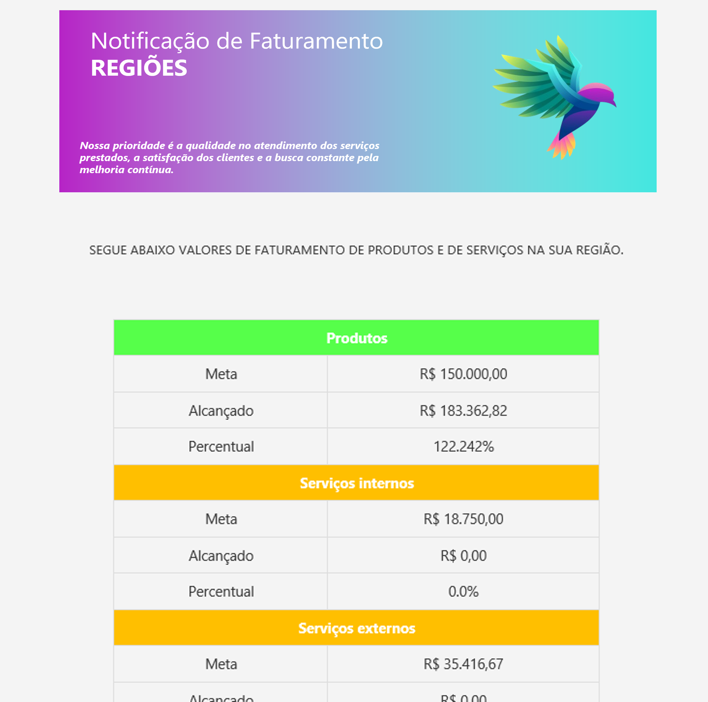

# PROJETO DE ENVIO DE FATURAMENTO VIA E-MAIL

# Projeto de Envio de Faturamento

Este projeto foi desenvolvido para enviar o faturamento de uma empresa utilizando o ERP Maxiprod, que possui uma API GraphQL. O projeto faz uso de Python, HTML, CSS e diversas bibliotecas para realizar a integração e apresentação dos dados.

## Funcionalidades

- Conexão com a API GraphQL do Maxiprod.
- Extração e processamento dos dados de faturamento.
- Envio dos dados processados.
- Email personalizado com html e css.

## Tecnologias Utilizadas

- **Python**: Linguagem principal do projeto.
- **HTML**: Estrutura do email.
- **CSS**: Estilização do html.
- **Bibliotecas**:
  - `requests`: Para realizar as requisições HTTP.
  - `pandas`: Para manipulação e análise dos dados.

## Estrutura do Projeto

- `scripts/`: Contém os scripts do projeto.
- `setupFiles/`: Contém os arquivos de imagem e metas do projeto.
- `execute.py`: Executa o programa.

## Exemplo de Uso

Abaixo está uma imagem demonstrativa da interface web:

